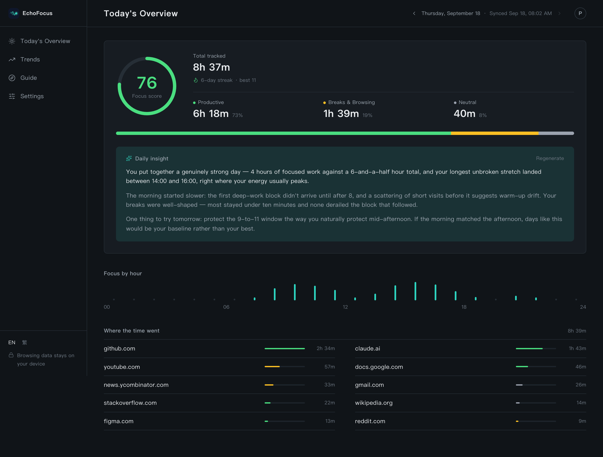
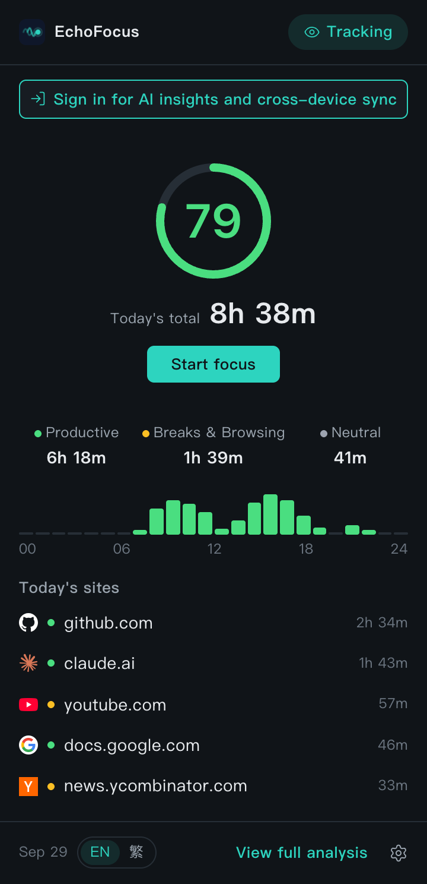
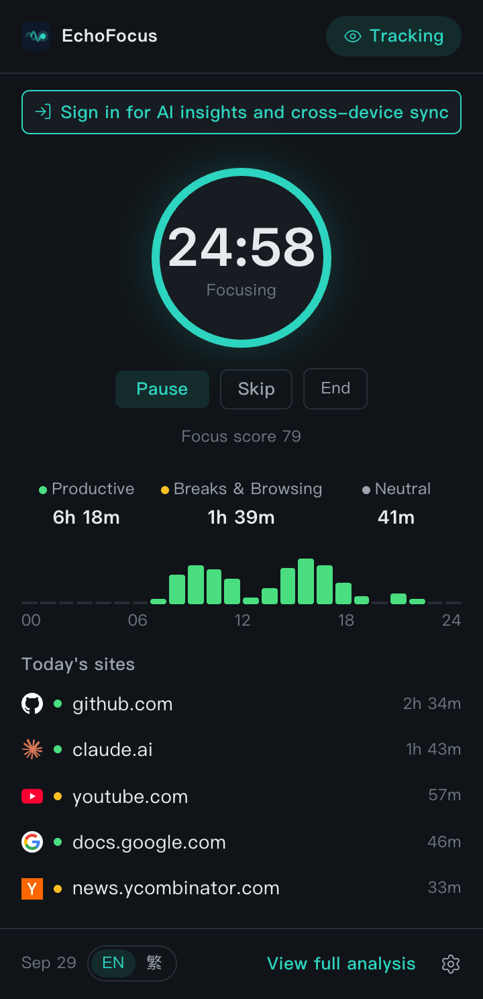
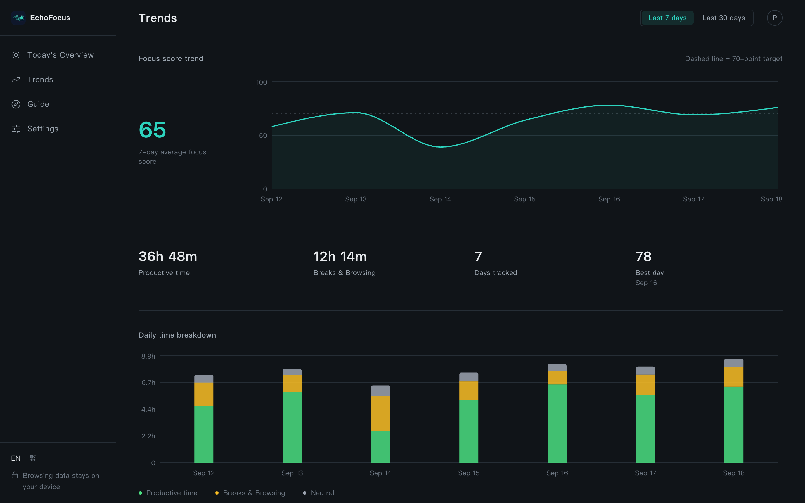
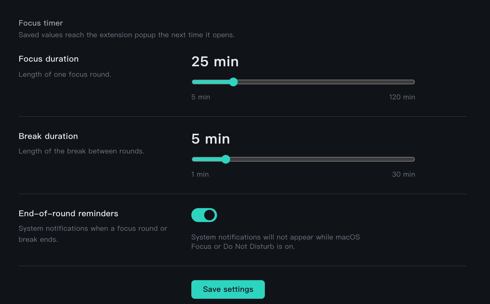
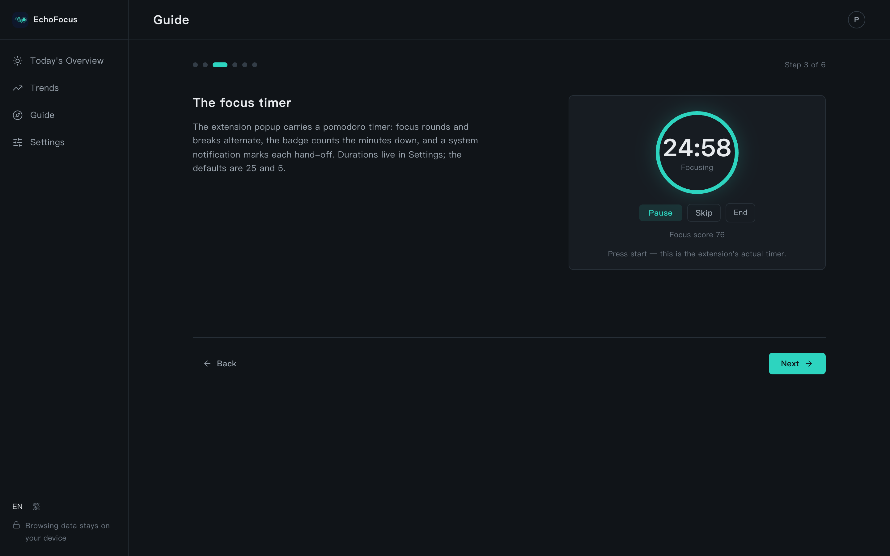
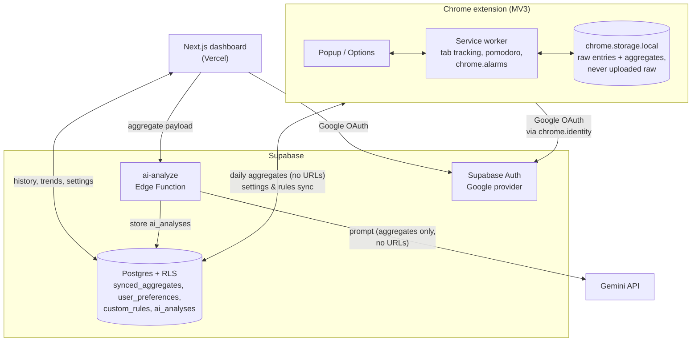

# EchoFocus

A privacy-first productivity tracker: a Chrome extension that times the tab in front of you, scores your focus, and runs a pomodoro timer — with a web dashboard for history, trends, and AI-written daily reviews. Built for people in long deep-focus stretches (exam prep, job hunting) who want the numbers without handing their browsing history to a server.

**The core privacy invariant: raw URLs and page titles never leave the device.** Only per-day aggregates (domain names + durations + categories) sync to the cloud, and only after sign-in.

## Screenshots

All in the dark theme.



<table>
  <tr>
    <td width="50%"><br><sub>Popup, idle</sub></td>
    <td width="50%"><br><sub>Popup, focus round</sub></td>
  </tr>
  <tr>
    <td width="50%"><br><sub>Trends</sub></td>
    <td width="50%"><br><sub>Settings, focus timer</sub></td>
  </tr>
  <tr>
    <td colspan="2"><br><sub>Guide, the live timer component</sub></td>
  </tr>
</table>

## Architecture



## Key technical decisions

**Background timing on `chrome.alarms`, never timers.** MV3 service workers are killed after ~30s idle, so `setTimeout` cannot survive a pomodoro round. Every schedule (phase ends, nightly sync, heartbeat) is an alarm with an absolute `when`; state lives in storage, and the popup derives its countdown from a stored end timestamp.

**Local-first, sign-in backfills.** The full product — tracking, scoring, timer — works with no account, storing everything locally. Signing in unlocks the dashboard and sync, and `postSignInBootstrap()` uploads the entire local archive (365-day scan, batched upserts) so a try-first-register-later user never starts from zero.

**Two sessions, one sign-out.** The extension and the dashboard each hold their own Supabase session, one click apiece: the extension signs in with Google through `chrome.identity.launchWebAuthFlow`, the dashboard through the regular web OAuth redirect. Sharing one session would put two clients on one refresh-token family and trip reuse detection. Sign-out is shared without any channel between them: both sides revoke globally, and the popup checks its session server-side (throttled) when it opens, so a dashboard sign-out reaches the extension on its next open.

**Settings sync accepts last-writer-wins.** Options and Dashboard Settings edit the same cloud row; a "local non-default wins" merge runs only on first contact. Concurrent cross-device edits resolve LWW — a documented trade-off chosen over conditional-write machinery for a single-user product.

**Notification IDs are cleared before re-creation.** `chrome.notifications.create` over an ID still sitting in the macOS Notification Center replaces it *without re-alerting* — so every banner after the first silently vanished. The fix is a `clear()` before each `create()`, plus surfacing `runtime.lastError` instead of dropping it.

**A design system as a contract.** `DESIGN.md` is the single source of truth for tokens, type scale, motion, and per-surface specs; both apps consume the same CSS variables, the pomodoro module is one shared React component (popup and the dashboard Guide's hands-on demo), and spec changes are committed alongside the code they sanction.

## Tech stack

- **Extension**: Chrome MV3 · Vite + CRXJS · React · TypeScript · Tailwind
- **Dashboard**: Next.js 15 (App Router) on Vercel · React 19 · Tailwind · Recharts
- **Backend**: Supabase (Auth, Postgres with RLS, Edge Functions)
- **AI**: Gemini via a rate-limited edge function proxy
- **Monorepo**: pnpm workspaces (`packages/shared` for types, tokens, and shared UI) · Vitest (mutation-validated suites)

## Local development

```bash
pnpm install

pnpm dev:web           # Next.js dev server on localhost:3000
pnpm dev:extension     # extension build in watch mode
pnpm build:extension   # production build → apps/extension/dist
                       # then load dist/ via chrome://extensions → Load unpacked

pnpm typecheck         # all packages
pnpm -r test           # all suites
```

Environment variables: see `apps/web/.env.local` and `apps/extension/.env` (Supabase URL + anon key); edge function secrets (`GEMINI_API_KEY`) are set in Supabase. Database migrations live in `supabase/migrations/`.
