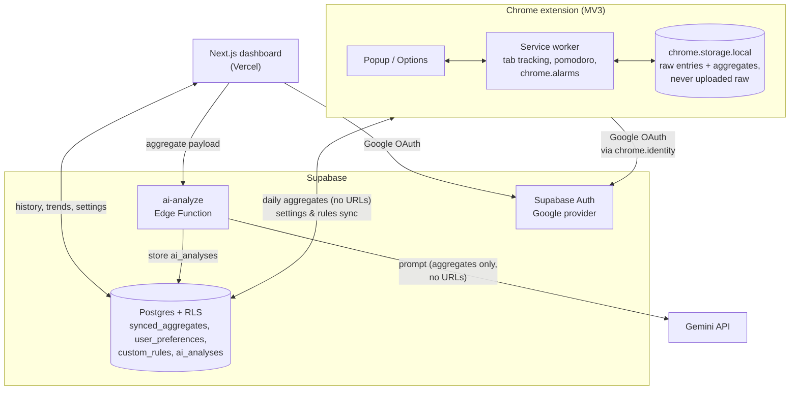

# EchoFocus

EchoFocus is a Chrome extension that times the tab in front of you, scores your focus, and runs a pomodoro timer. A web dashboard shows your history, your trends, and a daily review that Gemini writes from your numbers. EchoFocus is for long stretches of focused work, like exam prep or a job hunt, when you want to see where the hours went without handing your browsing history to a server.

**Raw URLs and page titles stay on your device.** Nothing syncs until you sign in. After that, the extension keeps one aggregate per day in your account, made of domain names, durations, and categories. Today's is updated every hour, and each day is finished at 00:05.

## Screenshots

All screenshots use the dark theme.


<table>
  <tr>
    <td width="50%"><br><sub>Popup, idle</sub></td>
    <td width="50%"><br><sub>Popup, focus round</sub></td>
  </tr>
  <tr>
    <td width="50%"><br><sub>Trends</sub></td>
    <td width="50%"><br><sub>Settings, focus timer</sub></td>
  </tr>
  <tr>
    <td colspan="2"><br><sub>Guide, the live timer component</sub></td>
  </tr>
</table>

## Architecture



## Key technical decisions

**Background timing runs on `chrome.alarms`.** Chrome stops an MV3 service worker after ~30s idle, so a `setTimeout` cannot outlast a pomodoro round. Every schedule (phase ends, nightly sync, heartbeat) is an alarm with an absolute `when`. State lives in storage, and the popup computes its countdown from a stored end timestamp.

**Signing in backfills local history.** Tracking, scoring, and the timer work without an account and keep everything local. Signing in unlocks the dashboard and sync, and `postSignInBootstrap()` uploads the whole local archive (a 365-day scan in batched upserts), so someone who tries EchoFocus first and registers later keeps their history.

**Two sessions, one sign-out.** The extension and the dashboard each hold their own Supabase session and sign in with one click: the extension through Google with `chrome.identity.launchWebAuthFlow`, the dashboard through the regular web OAuth redirect. One shared session would put two clients on a single refresh-token family and trip reuse detection. Sign-out needs no channel between them. Both sides revoke globally, and the popup checks its session with the server (throttled) when it opens, so a dashboard sign-out reaches the extension on its next open.

**Settings sync accepts last-writer-wins.** Options and Dashboard Settings edit the same cloud row, and a "local non-default wins" merge runs only on first contact. When two devices edit at the same time, the last write wins. That trade-off is documented, and for a single-user product it beats building conditional writes.

**The worker clears a notification before reusing its ID.** On macOS, `chrome.notifications.create` with an ID still sitting in Notification Center replaces the entry *without re-alerting*, so no banner after the first one ever showed. The worker now calls `clear()` before each `create()` and surfaces `runtime.lastError` instead of dropping it.

**`DESIGN.md` is the design contract.** It defines the tokens, type scale, motion, and per-surface specs. Both apps read the same CSS variables, the popup and the dashboard Guide's hands-on demo render one shared pomodoro React component, and each spec change lands in the same commit as the code it covers.

## Tech stack

- **Extension**: Chrome MV3, Vite + CRXJS, React, TypeScript, Tailwind
- **Dashboard**: Next.js 15 (App Router) on Vercel, React 19, Tailwind, Recharts
- **Backend**: Supabase (Auth, Postgres with RLS, Edge Functions)
- **AI**: Gemini behind a rate-limited edge function proxy
- **Monorepo**: pnpm workspaces (`packages/shared` holds types, tokens, and shared UI), Vitest suites checked with mutation testing

## Local development

```bash
pnpm install

pnpm dev:web           # Next.js dev server on localhost:3000
pnpm dev:extension     # extension build in watch mode
pnpm build:extension   # production build → apps/extension/dist
                       # then load dist/ via chrome://extensions → Load unpacked

pnpm typecheck         # all packages
pnpm -r test           # all suites
```

Environment variables: `apps/web/.env.local` and `apps/extension/.env` each need the Supabase URL and anon key. Edge function secrets (`GEMINI_API_KEY`) live in Supabase, and database migrations live in `supabase/migrations/`.
