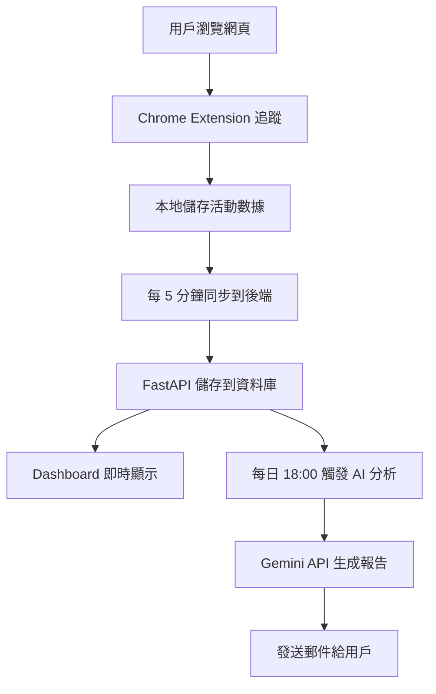

# 🎯 Productivity Tracker - 團隊展示文檔

## 專案簡介

一個幫助用戶追蹤和提升生產力的智能系統 - **完全免費** 🎉

---

## 🎨 視覺化展示

### 1. Chrome Extension 彈出視窗

```
╔════════════════════════════════╗
║  📊 Productivity Tracker       ║
║     追蹤你的每一刻             ║
╠════════════════════════════════╣
║                                ║
║  追蹤狀態                      ║
║  🟢 進行中                     ║
║                                ║
║  今日統計                      ║
║  ┌──────────┬──────────┐       ║
║  │  2.5 h   │  0.8 h   │       ║
║  │ 專注時數 │ 分心時數 │       ║
║  └──────────┴──────────┘       ║
║                                ║
║  [  暫停追蹤  ]                ║
║  [  立即同步數據  ]            ║
║  [  打開儀表板  ]              ║
║                                ║
║  每 5 分鐘自動同步 • AI 分析每日發送  ║
╚════════════════════════════════╝
```

### 2. Web Dashboard

```
╔══════════════════════════════════════════════════════════╗
║            📊 Productivity Dashboard                     ║
║               追蹤你的生產力旅程                        ║
╠══════════════════════════════════════════════════════════╣
║                                                          ║
║  ┌─────────┬─────────┬─────────┬─────────┐             ║
║  │   5.2   │   3.5   │   1.2   │   74%   │             ║
║  │總追蹤時數│生產力時數│分心時數│專注分數│             ║
║  └─────────┴─────────┴─────────┴─────────┘             ║
║                                                          ║
║  最近活動                                               ║
║  ┌────────────────────────────────────────┐             ║
║  │ ✅ github.com         2.5h  │ 生產力 │             ║
║  │ ✅ stackoverflow.com  1.0h  │ 生產力 │             ║
║  │ ⚠️  youtube.com        0.8h  │  分心  │             ║
║  │ ➖ gmail.com           0.5h  │  中性  │             ║
║  └────────────────────────────────────────┘             ║
║                                                          ║
║             [  刷新數據  ]                              ║
╚══════════════════════════════════════════════════════════╝
```

### 3. AI 每日總結郵件

```
╔════════════════════════════════════════╗
║      📊 今日生產力報告                 ║
║         2024年2月3日                   ║
╠════════════════════════════════════════╣
║                                        ║
║   ┌─────────┐  ┌─────────┐           ║
║   │   3.5   │  │   74%   │           ║
║   │ 專注時數│  │ 專注分數│           ║
║   └─────────┘  └─────────┘           ║
║                                        ║
║ ┌────────────────────────────────┐   ║
║ │ 做得不錯！                      │   ║
║ │                                 │   ║
║ │ 你今天保持了不錯的生產力，繼續│   ║
║ │ 保持！今天你投入了 3.5 小時在  │   ║
║ │ 有意義的工作上，這佔了你總時間│   ║
║ │ 的 74%。                        │   ║
║ │                                 │   ║
║ │ 我注意到你在 github.com 上花費 │   ║
║ │ 了最多時間。這顯示你知道如何專│   ║
║ │ 注於重要的事情。               │   ║
║ │                                 │   ║
║ │ 💡 改善建議：                   │   ║
║ │ 1. 嘗試使用番茄鐘技巧，每 25   │   ║
║ │    分鐘專注工作，休息 5 分鐘   │   ║
║ │ 2. 考慮在最容易分心的時段安排  │   ║
║ │    較輕鬆的任務                │   ║
║ │ 3. 設定每日專注時間目標，逐步  │   ║
║ │    提升到 4 小時               │   ║
║ │                                 │   ║
║ │ 明天繼續加油！🚀               │   ║
║ └────────────────────────────────┘   ║
╚════════════════════════════════════════╝
```

---

## 🎬 用戶使用流程

### 第一次使用

```
1. 安裝 Chrome Extension
   └─> 打開 Chrome Extension 商店（或本地載入）
   
2. 註冊/登入
   └─> 輸入郵件地址（用於接收每日報告）
   
3. 開始使用
   └─> Extension 自動追蹤你的瀏覽活動
   └─> 無需手動操作，背景運行
```

### 日常使用

```
早上 9:00  →  開始工作，Extension 自動追蹤
             │
             ├─> 訪問 GitHub、Stack Overflow（標記為「生產力」）
             ├─> 查看郵件（標記為「中性」）
             └─> 休息看 YouTube（標記為「分心」）
             
中午 12:00 →  查看 Extension 彈出視窗
             └─> 今日已專注 2.5 小時 ✨
             
下午 6:00  →  收到 AI 每日總結郵件
             └─> "今天你投入了 5 小時在工作上，做得很棒！"
             └─> 提供 3 個改善建議
             
晚上       →  打開 Dashboard 查看詳細數據
             └─> 看到時間分布圖表
             └─> 了解自己的工作模式
```

---

## 💡 解決的問題

### 😫 痛點 1：不知道時間都去哪了
**解決方案：** 自動追蹤，每秒記錄，無需手動輸入

### 😫 痛點 2：想提升生產力但不知道如何改進
**解決方案：** AI 分析你的工作模式，提供個性化建議

### 😫 痛點 3：容易忘記反思和總結
**解決方案：** 每天固定時間發送郵件提醒，養成好習慣

### 😫 痛點 4：市面上的工具太複雜或太貴
**解決方案：** 簡單易用，完全免費，開源可自訂

---

## 🛠️ 技術亮點

### 1. 全端整合
```
Chrome Extension (JS) 
    ↓ HTTP API
FastAPI Backend (Python)
    ↓ 
AI Analysis (Gemini)
    ↓
Email Service (SMTP)
```

### 2. 智能分類
- 自動識別生產力網站 vs 分心網站
- 用戶可自訂分類規則
- 機器學習優化（未來擴展）

### 3. 數據隱私
- 數據存在本地或自己的伺服器
- 不上傳到第三方
- 用戶完全控制

---

## 📊 數據流程



---

## 🎯 MVP 功能（最小可行產品）

### ✅ 必須有的功能
1. Chrome Extension 追蹤網站使用時間
2. 簡單的 Web Dashboard 顯示統計
3. 基本的 AI 分析（即使是模擬的）
4. 發送每日總結郵件

### 🎁 加分功能（時間允許）
1. 用戶可以自訂生產力網站分類
2. 更豐富的圖表（折線圖、圓餅圖）
3. 週報、月報功能
4. 暗黑模式 UI
5. 真實的 Gemini API 整合

---

## 💰 成本分析

### 開發階段：$0
- Gemini API：免費額度 1500 次/天
- GitHub：免費
- 本地測試：免費

### 部署階段：$0
- Render：免費方案
- SQLite：免費
- Gmail SMTP：免費（500 封/天）

### 總計：**完全免費** 🎉

---

## 👥 團隊分工（4人）

```
Person 1: Chrome Extension 開發
├─ manifest.json
├─ background.js (追蹤邏輯)
└─ popup.html/js (UI)

Person 2: Backend API
├─ FastAPI 設定
├─ 資料庫設計
├─ API endpoints
└─ 用戶認證

Person 3: AI 整合 & 排程
├─ Gemini API 串接
├─ 提示詞設計
├─ 排程任務（每日觸發）
└─ 數據處理

Person 4: Dashboard & Email
├─ Web Dashboard UI
├─ 圖表視覺化
├─ 郵件模板設計
└─ Email 發送服務
```

**預計時程：3-4 週**

---

## 🚀 Demo 計畫

### Week 1: 基礎設定
- 所有人設定開發環境
- Person 1-2 完成基礎架構
- 第一次整合測試

### Week 2: 核心功能
- Extension 能追蹤並發送數據
- Backend 能接收並儲存
- Dashboard 能顯示基本統計

### Week 3: AI 整合
- AI 分析功能完成
- 郵件服務整合
- End-to-End 測試

### Week 4: 優化 & 展示
- Bug 修復
- UI 美化
- 準備 Demo 簡報
- 錄製展示影片

---

## 📝 展示重點

### 對教授/評審：
1. **完整的全端開發** - 展示前後端整合能力
2. **實用的 AI 應用** - 不是為了 AI 而 AI
3. **良好的團隊協作** - Git workflow, code review
4. **解決真實問題** - 學生/工作者的痛點

### 對未來雇主：
1. **現代技術棧** - React/FastAPI/AI API
2. **系統設計能力** - 完整的架構圖
3. **產品思維** - 從用戶需求出發
4. **可擴展性** - 清晰的未來規劃

---

## ❓ 常見問題

**Q: 這個專案會很難嗎？**
A: 不會！每個部分都有清楚的範例代碼，跟著做就行。

**Q: 我們沒學過 Chrome Extension 怎麼辦？**
A: 已經提供完整的範例，只需要理解邏輯即可。

**Q: AI 整合會很複雜嗎？**
A: 不會！只是調用 API，幾行代碼就能完成。

**Q: 需要花錢嗎？**
A: 完全不用！所有服務都有免費方案。

**Q: 時間夠嗎？**
A: 3-4 週綽綽有餘，而且有完整的範例代碼。

---

## 🎁 額外資源

### 學習資源
- Chrome Extension 官方文檔
- FastAPI 官方教學
- Gemini API 快速開始

### 範例代碼
- 完整的 Demo 專案（已提供）
- 詳細的註解說明
- Step-by-step 教學

---

## 🌟 為什麼選這個專案？

✅ **實用性強** - 自己也會用
✅ **技術全面** - 前後端 + AI 都有
✅ **簡歷加分** - 展示多種能力
✅ **完全免費** - 不用花錢
✅ **可擴展性高** - 未來可以繼續開發
✅ **有現成範例** - 降低風險

---

**準備好開始了嗎？讓我們打造一個超酷的生產力工具！💪**
